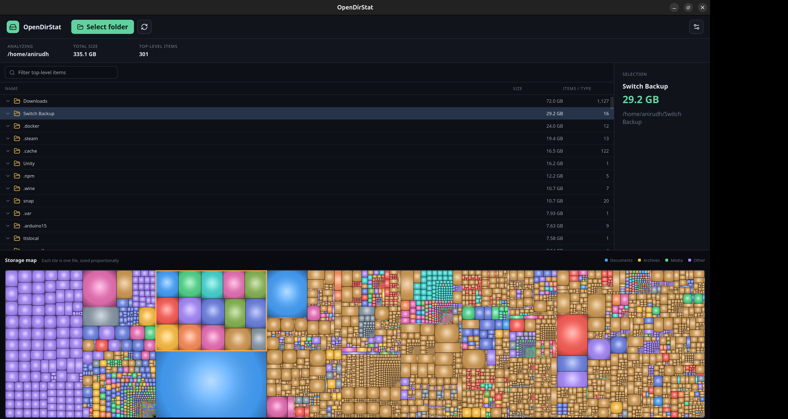

# OpenDirStat

OpenDirStat is a fast, cross-platform disk usage analyzer inspired by WinDirStat
and QDirStat. It combines a native Rust filesystem index with a responsive Tauri
interface and a dense, hierarchical cushion treemap.



## Highlights

- Scan any accessible folder, drive, or filesystem root.
- Traverse directory trees in parallel with bounded native workers.
- Inspect live file, directory, byte, and current-path progress.
- Cancel long scans without blocking the interface.
- Navigate a size-sorted, lazily loaded directory tree.
- Explore a directory-contained squarified cushion treemap.
- Select files and directories bidirectionally between the tree and treemap.
- Continue past unreadable entries and avoid symbolic-link cycles.

The full filesystem index remains in Rust. Directory rows are queried lazily and
the treemap receives a size-preserving visual representation, avoiding
multi-million-node payloads between Rust and the webview.

## Downloads

Installers for Linux, Windows, Intel macOS, and Apple Silicon macOS are attached
to each entry on the repository's **Releases** page.

> macOS and Windows builds are currently unsigned. The operating system may
> display a security warning until release signing is configured.

## Development

Requirements:

- Node.js 20 or newer
- Rust stable
- [Tauri 2 platform prerequisites](https://v2.tauri.app/start/prerequisites/)

```bash
npm ci
npm run tauri dev
```

The interface can also be previewed with representative data in a browser:

```bash
npm run dev
```

Run all local checks:

```bash
npm run build
cd src-tauri
cargo fmt --check
cargo clippy --all-targets -- -D warnings
cargo test
```


## Scan semantics

- Sizes are logical file sizes rather than allocated-on-disk sizes.
- Symbolic links are listed but not followed.
- Entries that cannot be read are skipped.
- Hard-linked files can currently be counted more than once.

## License

OpenDirStat is released under the [WTFPL](LICENSE).
